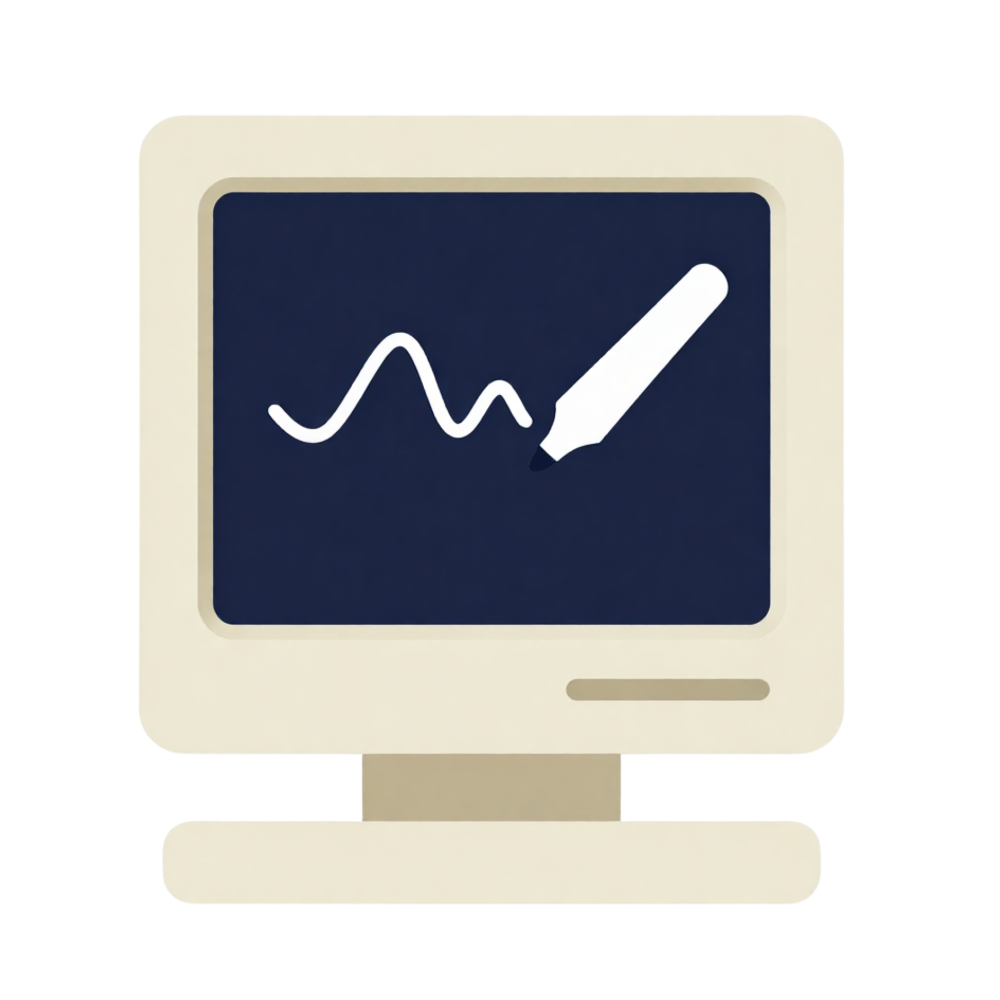

<p align="center">
  
</p>

<h1 align="center">Whitespace</h1>

<p align="center">
  Turn your macOS desktop into an interactive, Excalidraw-style whiteboard —
  native, written in Swift.
</p>

---

Whitespace lives **on the desktop layer**, above your wallpaper. Toggle drawing
mode and the whole desktop becomes a hand-drawn whiteboard with a floating Liquid
Glass tool palette; toggle it off and your drawings sit quietly behind your icons.
Files and notes can be dropped in as linked nodes, and everything reads/writes the
`.excalidraw` format so it interoperates with Excalidraw itself.

It's **fully native** — custom Core Graphics rendering with the rough.js sketchy
look re-implemented in pure Swift. No web view, no Electron.

## Features

- **Desktop-layer canvas** — a borderless `NSWindow` pinned to the desktop; the
  whole desktop becomes your board.
- **Hand-drawn aesthetic** — a faithful Swift port of the rough.js renderer:
  seeded jitter, hachure / cross-hatch / solid fills, sketchy ellipses, three
  roughness levels (Architect / Artist / Cartoonist).
- **Tools** — select, rectangle, ellipse, diamond, arrow, elbow ("checker")
  arrow, line, freehand pen, and text.
- **Smart arrows** — arrows/lines **bind to shapes**: drop an endpoint on a shape
  and the arrow links to it, snapping to the edge and re-routing when the shape
  moves or resizes. Drag endpoint handles to adjust.
- **Editing** — move, resize (shapes scale, **text scales its font to fit**),
  multi-select marquee, z-order, undo/redo, copy/cut/paste (incl. system text),
  and double-click to add or edit text.
- **Link files & notes** — press **/** to Spotlight-search your files and drop a
  linked node; double-click it to open. Works with `obsidian://` and web links.
- **Export** — to **PNG** (raster) and **SVG** (vector), matching the canvas.
- **Liquid Glass palette** — native macOS 26 `glassEffect`, docked left.
- **Excalidraw-compatible** — reads/writes `.excalidraw` JSON; autosaves to
  `~/Library/Application Support/Whitespace/`.

## Shortcuts

| Action | Shortcut |
|---|---|
| Toggle whiteboard (drawing mode) | **⌥⌘W** |
| Hide / show tool palette | **⌥⌘Q** |
| Tools | V · R · O · D · A · E · L · P · T |
| File-link search | **/** |
| Copy / Cut / Paste / Select all | ⌘C · ⌘X · ⌘V · ⌘A |
| Undo / Redo | ⌘Z · ⇧⌘Z |
| Delete selection | ⌫ |
| Pan / Zoom | scroll · ⌘-scroll / pinch |

## Build & run

Requires **Xcode 26 / Swift 6** on macOS.

```bash
swift build && .build/debug/Whitespace      # quick dev run
./make_app.sh                               # build Whitespace.app (release, with icon)
```

`make_app.sh` produces a Dock-less (`LSUIElement`) `Whitespace.app`. Install it so
Spotlight can find it:

```bash
mv Whitespace.app /Applications/
open -a Whitespace
```

Look for the scribble icon in the menu bar; **⌥⌘W** starts drawing.

## Architecture

| Path | Responsibility |
|---|---|
| `App/` | desktop window, menu-bar control, global hotkeys, settings |
| `Canvas/` | `CanvasView` (Core Graphics), camera/pan-zoom, tools, interaction |
| `Model/` | Excalidraw-compatible `Element`/document, scene state, undo, arrow binding |
| `Rough/` | Swift port of the rough.js renderer + hachure fill |
| `Render/` | element renderer (per-element CGPath cache) + PNG/SVG export |
| `UI/` | SwiftUI tool palette, Liquid Glass, file-search palette |

## Roadmap

- Rotation handles
- Multi-line in-place text editing (the editor is currently single-line)
- Editable mid-segments for elbow arrows
- Richer file nodes (real file icons, drag-and-drop from Finder)

🤖 Built with [Claude Code](https://claude.com/claude-code)
